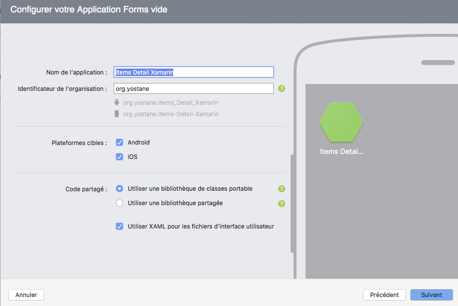
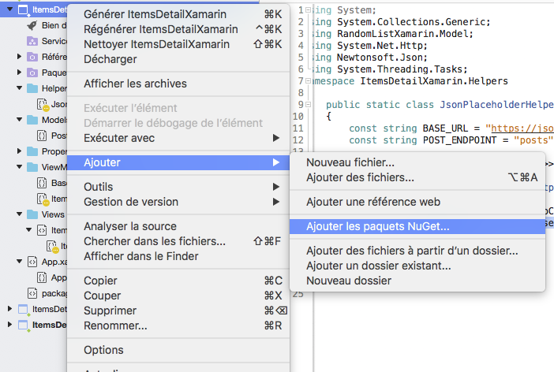

# Xamarin List view guide

- [Xamarin List view guide](#xamarin-list-view-guide)
    - [Creating the project](#creating-the-project)
    - [The ItemListView](#the-itemlistview)
    - [Fetching JSON from the internet](#fetching-json-from-the-internet)
    - [Displaying thumbnails](#displaying-thumbnails)
    - [Conclusion and going further](#conclusion-and-going-further)
    - [Links](#links)

This article will guide through the steps of creating a typical list / detail app using Xamarin Forms. The advantage of using Xamarin Forms is that we will obtain a native Android and iOS apps using a single C# / XAML codebase.

I am using macOS and Visual Studio Community for macOS but you can also follow the guide on Windows by using Visual Studio.

Let's start by the beginning of all projects; which is creating it :smiley_cat:.

## Creating the project

Open Visual Studio and create a new Project:

- Choose Blank App
- Enter a name, check both iOS and Android checkboxes (any other platforms if available) as well as the one for using XAML. Make sure to choose **Potable class library** option (the first one).
- Continue until you click on the **Create** button.



We should obtain a minimal solution that contains three projects (or more if you are on Windows :smile: ), the portable project, the iOS one and the Android one. We will only work on the portable project for 100% code sharing.

Before Starting to code, let's create some folders to organize our code. There will be 4 main folders: Views, ViewModels, Models and Helpers. Also, delete all XAML and XAML.CS files except **App.xaml** and **App.xaml.cs**.

As a reminder, we are creating a Xamarin forms app that fetches a list of items from the internet and shows in on a scrollable list. Each row of the list will display an item with some text content and a thumbnail. We are not going to developer neither the JSON API nor the thumbnail server. Instead, we'll use a free JSON generator for developers [jsonplaceholder.typicode.com](https://jsonplaceholder.typicode.com/) and a free image generator [picsum.photos](https://picsum.photos/).

In the next section, we will create the main view.

## The ItemListView

The main view of this tutorial shows random posts from [jsonplaceholder post API](https://jsonplaceholder.typicode.com/posts) and associates each one with a random thumbnail downloaded from [picsum.photos](https://picsum.photos/). In this section, we will create the model, the view and its view model with hard coded content but won't fetch any data from the network. Without further due, let's get going.

Firstly, in the *Models* folder, create a new class called `Post.cs` which represents a single post. Add the following properties: `Title`, `UserId`, `Id`, `Body`, `ÌmageUrl`. The first four properties will be later mapped from the Json reponse of the [jsonplaceholder post API](https://jsonplaceholder.typicode.com/posts) while the `ImageUrl` will be manually generated from code.

The `Post` class should look like this:

```cs
namespace RandomListXamarin.Model
{
    public class Post
    {
        public string Title { get; set; }
        public int UserId { get; set; }
        public int Id { get; set; }
        public string Body { get; set; }
        public string ImageUrl { get; set; }
    }
}
```

Secondly, create the view model class `ItemListViewModel` (a view model can be seen as an object that handles the data that will be displayed by the view). It defines the `Posts` of type `ObservableCollection<Post>`. This property stores the current list of posts and is well suited for finding to a visual component because it is an `ObservableCollection`. In addition to that, the view model inherits from a class called `BaseViewModel`. It is usual in *MVVM* to have this kind of base class that simplifies binding. Here is its definition that you just need to copy and paste.

```cs
namespace RandomListXamarin.ViewModels
{
    public class BaseViewModel : INotifyPropertyChanged
    {

        protected bool SetProperty<T>(ref T backingStore, T value,
            [CallerMemberName]string propertyName = "",
            Action onChanged = null)
        {
            if (EqualityComparer<T>.Default.Equals(backingStore, value))
                return false;

            backingStore = value;
            onChanged?.Invoke();
            OnPropertyChanged(propertyName);
            return true;
        }

        #region INotifyPropertyChanged
        public event PropertyChangedEventHandler PropertyChanged;
        protected void OnPropertyChanged([CallerMemberName] string propertyName = "")
        {
            var changed = PropertyChanged;
            if (changed == null)
                return;

            changed.Invoke(this, new PropertyChangedEventArgs(propertyName));
        }
        #endregion
    }
}
```

The ItemListViewModel class should look like this.

```cs
namespace RandomListXamarin.ViewModels
{
    public class ItemListViewModel : BaseViewModel
    {
        public ObservableCollection<Post> Posts { get; set; }

        public ItemListViewModel()
        {
            this.Posts = new ObservableCollection<Post>();
            //Just for tesing
            this.Posts.Add(new Post
            {
                Title = "test"
            });
            this.Posts.Add(new Post
            {
                Title = "test2"
            });
        }
    }
}
```

Note that in the constructor, we add two hard coded posts for the purpose of testing that binding the view model to the view actually works. We will replace it later with the content fetched from the API :smile:.

The third and last step in this section is to create the view that shows the `Posts` from the view model. In the *Views* folder, create a **Content Page XAML form** by right clicking on that folder, then by choosing Add -> New file -> **Content Page XAML form**. You can name it *ItemListPage.xaml*.

After that, Open the code behind file *ItemListPage.xaml.cs*. There, define an  `ItemListViewModel` instance variable and set it as a `BindingContext` in the constructor. The `BindingContext` tells Xamarin which object is used when binding with visual components. The code behind should resemble to the following code:

```cs
namespace ItemsDetailXamarin.Views
{
    public partial class ItemListPage : ContentPage
    {
        ItemListViewModel itemListViewModel;

        public ItemListPage()
        {
            InitializeComponent();
            itemListViewModel = new ItemListViewModel();
            BindingContext = itemListViewModel;
        }
    }
}
```

Next, open the *XAML* file where we create a `ListView` control that binds to the `Posts` property of the `BindingContext` (which is an instance of `ItemListViewModel`). The visual representation of each item of the list can be defined using `ListViewItem.ItemTemplate` tag. The very interesting thing is that inside this tag, we are automagically bound to the current `Post` item. For example, this snippet shows the titles of the posts.

```xml
<ListView ItemsSource="{Binding Posts}">
    <ListView.ItemTemplate>
        <DataTemplate>
            <ViewCell>
                <Label Text="{Binding Title}" VerticalTextAlignment="Center" FontSize="Small" />
            </ViewCell>
        </DataTemplate>
    </ListView.ItemTemplate>
</ListView>
```

The following XAML file is more interesting because it shows also an image which is bound to the `ImageUrl`. Here is the full content of *ItemListPage.xaml*.

```xml
<?xml version="1.0" encoding="UTF-8"?>
<ContentPage xmlns="http://xamarin.com/schemas/2014/forms" xmlns:x="http://schemas.microsoft.com/winfx/2009/xaml" x:Class="ItemsDetailXamarin.Views.ItemListPage">
    <ContentPage.Content>
        <ListView ItemsSource="{Binding Posts}" VerticalOptions="FillAndExpand" CachingStrategy="RecycleElement">
            <ListView.ItemTemplate>
                <DataTemplate>
                    <ViewCell>
                        <StackLayout Padding="5,0,5,0" HorizontalOptions="StartAndExpand" Orientation="Horizontal">
                            <Image Source="{Binding ImageUrl}" WidthRequest="50" HeightRequest="50"  />
                            <Label Text="{Binding Title}" VerticalTextAlignment="Center" FontSize="Small" />
                        </StackLayout>
                    </ViewCell>
                </DataTemplate>
            </ListView.ItemTemplate>
        </ListView>
    </ContentPage.Content>
</ContentPage>
```

Finally, in the `App.xaml.cs`'s constructor, set the `MainPage` to be an instance of `ItemListPage` as follows.

```cs
public App()
{
    InitializeComponent();

    MainPage = new ItemListPage();
}
```

Run the app on iOS or Android, you should see a similar screen to this screenshot:


In the next section, we will download the posts from the internet and display them on the list as soon as they are available :muscle:.

## Fetching JSON from the internet

Downloading JSON files and parsing in Xamarin is very easy thanks to .Net Standard. In fact, downloading data using `HttpClient` and parsing it using `Newtonsoft.Json` requires a little bit code.

As a proof, here is the snippet that downloads the posts from the API:

```cs
const string BASE_URL = "https://jsonplaceholder.typicode.com/";
const string POST_ENDPOINT = "posts";
using (var httpClient = new HttpClient())
    {
        var jsonString = await httpClient.GetStringAsync(BASE_URL + POST_ENDPOINT);
    }
}
```

Parsing is also straight forward after annotating the `Post` class:

```cs
var posts = JsonConvert.DeserializeObject<List<Post>>(jsonString);
return posts;
```

Now that you are convinced :stuck_out_tongue_winking_eye:, let's implement that.

First of all, add the `Newtonsoft.Json` library to the project using NuGet. Right-click on the common project and choose Add -> Add NuGet package



Look for `Newtonsoft.Json` and add it to the portable class library project.


We can now fully implement our logic. Continue by adding somme attributes to the properties of the `Post` class. They tell the Json parser how to map the properties from the Json string to the properties of the `Post` class. To better understand, let's look at a snippet of the Json received by calling [https://jsonplaceholder.typicode.com/posts](https://jsonplaceholder.typicode.com/posts).

```json
[
  {
    "userId": 1,
    "id": 1,
    "title": "sunt aut facere repellat provident occaecati excepturi optio reprehenderit",
    "body": "quia et suscipit\nsuscipit recusandae consequuntur expedita et cum\nreprehenderit molestiae ut ut quas totam\nnostrum rerum est autem sunt rem eveniet architecto"
  },
  //other posts
]
```

Here, we want to map `userId` field of the Json with the `UserId` field of the `Post` class and so on. We do this by putting `[JsonProperty("userId")]` before the `UserId` property declaration.

Here is the updated `Posts` class with all the annotations:

```cs
using Newtonsoft.Json;

namespace RandomListXamarin.Model
{
    public class Post
    {
        [JsonProperty("title")]
        public string Title { get; set; }

        [JsonProperty("userId")]
        public int UserId { get; set; }

        [JsonProperty("id")]
        public int Id { get; set; }

        [JsonProperty("body")]
        public string Body { get; set; }

        public string ImageUrl { get; set; }
    }
}
```

No surprise here. Note that we didn't map the ImageUrl property since it is not present in the Json API. But we still need it for later use. The next step consists of downloading and parsing the Json file.

If you remember, I already showed how to download a Json file and also how to parse it. Let's put that together in a `GetPostsAsync` method. Since this is more of a helper method, please define it in the `JsonPlaceholderHelper` static class and place it inside the **Helpers** folder. That's some clean organization :file_folder:.

Here is the content of the `JsonPlaceholderHelper` class:

```cs
using System.Collections.Generic;
using RandomListXamarin.Model;
using System.Net.Http;
using Newtonsoft.Json;
using System.Threading.Tasks;
namespace ItemsDetailXamarin.Helpers
{
    public static class JsonPlaceholderHelper
    {
        const string BASE_URL = "https://jsonplaceholder.typicode.com/";
        const string POST_ENDPOINT = "posts";

        public static async Task<List<Post>> GetPostsAsync()
        {
            using (var httpClient = new HttpClient())
            {
                var jsonString = await httpClient.GetStringAsync(BASE_URL + POST_ENDPOINT);
                var posts = JsonConvert.DeserializeObject<List<Post>>(jsonString);
                return posts;
            }
        }
    }
}
```

There are two more things to do before getting the posts displayed. The first one consists in adding a method to the view model that calls the previously defined helper method and sets the returned posts to the `Posts` collection. Please add this method to the `ItemListViewModel`

```cs
public async Task UpdatePostsAsync()
{
    var newPosts = await JsonPlaceholderHelper.GetPostsAsync();
    this.Posts.Clear();
    newPosts.ForEach((post) =>
    {
        this.Posts.Add(post);
    });
}
```

The last thing to code is to fire the `UpdatePostsAsync` in order to get content. There are many ways to do it. One solution is to override the `OnAppearing` method of `ItemListPage` because it is automatically called just before the page appears. Again, please add this code to *ItemListPage.xaml.cs*'s `ItemListPage` class.

```cs
protected override async void OnAppearing()
{
    base.OnAppearing();
    await itemListViewModel.UpdatePostsAsync();
}
```

Launch the app again. Wow it works :sparkler:. However, there are no thumbnails yet. The next section deals with that.


## Displaying thumbnails

As the previous tasks, showing thumbnails is very easy. Since the `ImageUrl` property was already bound to list items, we just need to set a correct ImageUrl and that's it. Xamarin automatically, downloads the images, show it and as a bonus, caches it for us.

In this guide, we are going to download images from [picsum.photos](https://picsum.photos/), particularly this type of url: [https://picsum.photos/70/?image={an integer value}](https://picsum.photos/70/?image=[an integer value) where the integer value corresponds to the index of the post in the list. For example the thumbnail url of the post at index 57 is [https://picsum.photos/70/?image=58](https://picsum.photos/70/?image=58). In code, update the `UpdatePostsAsync` method as follows:

```cs
public async Task UpdatePostsAsync()
{
    var newPosts = await JsonPlaceholderHelper.GetPostsAsync();
    this.Posts.Clear();
    newPosts.ForEach((post) =>
    {
        post.ImageUrl = "https://picsum.photos/70/?image=" + newPosts.IndexOf(post);
        this.Posts.Add(post);
    });
}
```

The trick is to set the image url before adding it to the `Posts` collection.

If you run the app, the thumbnails should be shown progressively.


And that's all folks for now :rabbit2:.

## Conclusion and going further

This guide showed how to create a Xamarin app that downloads a Json array, parses it and shows it on a list along with thumbnails. Thanks to the Xamarin SDK and .Net Standard, we did not write a lot of code and we can run this app on both iOS and Android devices.

Further improvements can be implemented. For example, the list of posts can be persisted for offline use. Also, we can display a placeholder for thumbnails using the [FFImageLoading library](https://github.com/luberda-molinet/FFImageLoading).

I hope you liked working with Xamarin as much as myself :).

The project source is on [GitHub](https://github.com/yostane/xamarin_guide/tree/master/ItemsDetailXamarin). Happy coding.

## Links

- [https://jsonplaceholder.typicode.com](https://jsonplaceholder.typicode.com/)
- [https://picsum.photos](https://picsum.photos/).
- [FFImageLoading library](https://github.com/luberda-molinet/FFImageLoading)
- [Microsoft Docs](https://docs.microsoft.com/en-us/xamarin/xamarin-forms/user-interface/images?tabs=vswin)
