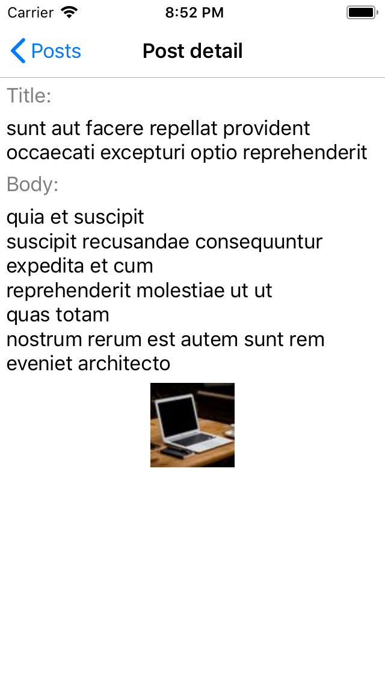
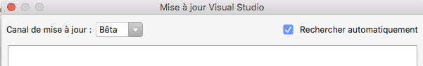
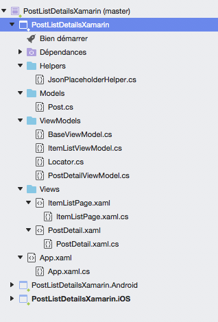
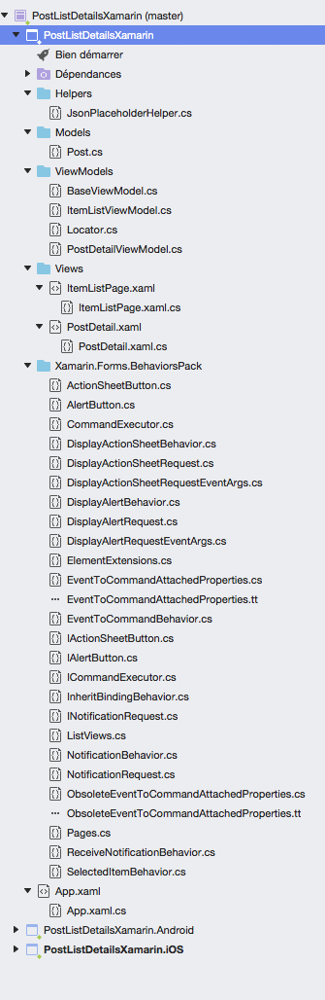
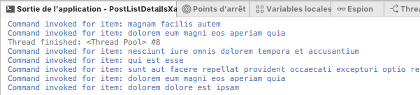
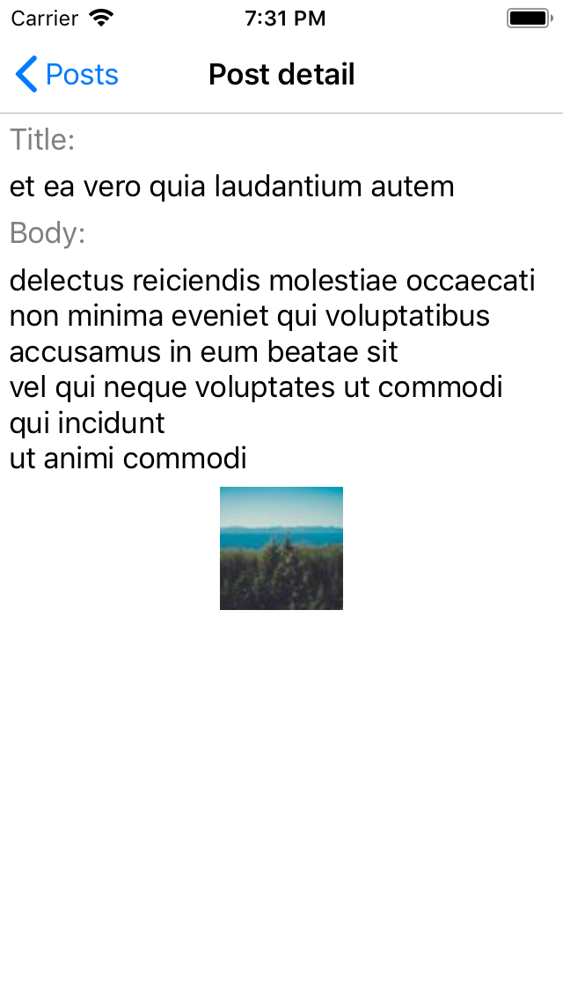

# Master detail navigation with Xamarin

In the previous guide, we developed a Xamarin that displays on a list data fetched from the internet. In this guide, we go further by showing a detail view when we tap on an item. We first create the new view without complying to mvmm. Then, we will try to organize the code with respect to the mvvm pattern. Let's begin.

## Adding the PostDetail page

Adding the detail page without considering MVVM is the easier and straightforward way. First, create the `PostDetailViewModel` class as well as the `PostDetail.xaml` page it's code-behind. The view model defines a property of type `Post` which is bound to the xaml view. The code-behind takes a parameter of type of type `Post`and passes it to the view model. Here is the code for each file:

PostDetailViewModel.cs

```cs
public class PostDetailViewModel : BaseViewModel
{
    private Post post;
    public Post Post
    {
        get => post;
        set => SetProperty(ref post, value);
    }

    public PostDetailViewModel(Post post)
    {
        this.Post = post;
    }
}
```

PostDetail.xaml

```xml
<?xml version="1.0" encoding="UTF-8"?>
<ContentPage xmlns="http://xamarin.com/schemas/2014/forms"
     xmlns:x="http://schemas.microsoft.com/winfx/2009/xaml"
     x:Class="PostListDetailsXamarin.Views.PostDetail" Title="Post detail">
    <ContentPage.Content>
        <StackLayout Orientation="Vertical" Padding="5,5,5,5">
            <Label TextColor="Gray">Title: </Label>
            <Label Text="{x:Binding Post.Title}" />
            <Label TextColor="Gray">Body: </Label>
            <Label Text="{x:Binding Post.Body}" />
            <Image Source="{x:Binding Post.ImageUrl}" WidthRequest="70"
                 HeightRequest="70" />
        </StackLayout>
    </ContentPage.Content>
</ContentPage>
```

PostDetail.xaml.cs

```cs
public partial class PostDetail : ContentPage
{
    PostDetailViewModel postDetailViewModel;

    public PostDetail()
    {
        InitializeComponent();
    }

    public PostDetail(Post post)
    {
        InitializeComponent();
        postDetailViewModel = new PostDetailViewModel(post);
        this.BindingContext = postDetailViewModel;
    }
}
```

In order to display this new view when the user taps the view, we will handle the onTap event of the `ListView`. Please add the `ItemSelected` attribute to the `ListView` in ItemListPage.xaml.

```xml
<ListView ItemsSource="{x:Binding Posts}"
        SelectedItem="{x:Binding SelectPost}"
        VerticalOptions="FillAndExpand" CachingStrategy="RecycleElement"
        ItemSelected="Handle_ItemSelected">
```

In this code snippet, the `Handle_ItemSelected` function handles the `ItemSelected` event. Here is the implementation of that function:

```cs
async void Handle_ItemSelected(object sender, Xamarin.Forms.SelectedItemChangedEventArgs e)
{
    var postDetailPage = new PostDetail(e.SelectedItem as Post);
    await Navigation.PushAsync(postDetailPage);
}
```

What we did here is that we ask the `Navigation` property of the `ContentPage` class to navigate to a new page. This new page is an instance of `PostDetail` class that takes the select post as a parameter.

Launch the app and tap on an item in the list. The detail page of that item should appear.



Here, we did it ..., or not. In fact, the code not really follow mvvm _principles_. Here are some of the **sins** of this code:

* The tap event is handled by the view instead of the view model through a command.
* Both the pages instantiate the view models instead of using an IoC container.

In the next section, We'll try to address these points.

## Handling the tap event using a command

A command is a mechanism that allows to handle events in the view model. It works by binding an event in the control to a command in the view model. In order for this to work we need two elements.

* The control must accepts a command property for the event that we want to handle
* The view model must provide a public command that handles the event
* The command in view model must be bound to the control

The second and third conditions are very easy to satisfy, because it is really to define a command and to bind it. However, there is one little gotcha. The ListView control does not accept natively a command property for the tapped event. Since we are not going to [buy a richer ListView control](https://www.telerik.com/purchase/xamarin-ui), we need to find another cue. Hopefully, there is a quite powerful technique in Xamarin that allows to exactly do that. It is called [**behaviors**](https://docs.microsoft.com/en-us/xamarin/xamarin-forms/app-fundamentals/behaviors/).

Behavrios are defined by MSDN as follows _"Behaviors lets you add functionality to user interface controls without having to subclass them. Behaviors are written in code and added to controls in XAML or code"_. That's exactly what we to do, which is invoke a command from the view model when the `SelectedItem` event is triggered. In order to add that behavior, we can follow the [MSDN guide](https://docs.microsoft.com/en-us/xamarin/xamarin-forms/app-fundamentals/behaviors/creating), or, since we are lazy programmers, we can use already defined ones.

Hopefully, some libraries are available on the internet. I recommend [Xamarin.Forms.BehaviorsPack](https://github.com/nuitsjp/Xamarin.Forms.BehaviorsPack) since it is the one that requires the least boilerplate code. Unfortunately, I had problems adding the NuGet packages of this library to my current projects. There were mainly two reasons. The first one is that the common project between iOS and Android is a PCL project instead of a .Net Standard 2.0 one. The second reason is that the XAML files fail to reference behavior classes defined in the library. After many tries, I ended-up replacing the PCL project with a .Net Standard project and using the source code of the library instead :scream:.

.Net Standard is a better way than PCL to share code between project and is the recommended way. In order to use .Net Standard 2.0 instead of PCL, we need to update to Visual Studio for Mac 7.5 and create a new project and copy all the xaml and cs files into the new project. Since version 7.5 was in beta at the time of writing, I had to switch to the **beta** option in the updates window. You can access it by clicking one Visual Studio Community menu -> updates.



After switching to beta update channel, some updates will popup. Install them and restart Visual Studio for Mac and you should be able to create Xamarin apps that use .Net Standard 2.0. Please go ahead and create a new empty Xamarin Forms project and **make sure** that that **.Net Standard** is selected.


Once the project is created, you can add the code that we already created by using the _Add->Add file_ or _Add-> Add files from folder_ or _Add->Add folder_. The project structure should be similar to the previous project that we created using a previous version of Visual Studio for Mac and that was using PCL.



Now, let's move on to adding the source code of [Xamarin.Forms.BehaviorsPack](https://github.com/nuitsjp/Xamarin.Forms.BehaviorsPack) to our project (as a reminder, I has to do that because I could not reference the NuGet library in xaml). Download and add to the .Net Standard project all the files in [this folder](https://github.com/nuitsjp/Xamarin.Forms.BehaviorsPack/tree/master/src/Xamarin.Forms.BehaviorsPack), except _Xamarin.Forms.BehaviorsPack.cs_ and _Xamarin.Forms.BehaviorsPack.csproj_. In my case, I put them in a folder named _Xamarin.Forms.BehaviorsPack_. The new project structure should look like this.



Yaay, we can finally add some fancy commands using behaviors. We will start by adding the behavior markup in the ItemListPage.xaml file. Two simple thinks need to be done here. First, in the content page tag, add an alias to the `Xamarin.Forms.BehaviorsPack` called `behaviorsPack` as follows.

```xml
<ContentPage xmlns="http://xamarin.com/schemas/2014/forms"
     xmlns:x="http://schemas.microsoft.com/winfx/2009/xaml"
     xmlns:behaviorsPack="clr-namespace:Xamarin.Forms.BehaviorsPack"
     xmlns:local="clr-namespace:PostListDetailsXamarin"
     x:Class="ItemsDetailXamarin.Views.ItemListPage" Title="Posts">
```

Second, link the behavior defined in `behaviorsPack:SelectedItemBehavior` to a command that we named `ItemSelectedCommand`. We will define it later in the view model.

```xml
<ListView ItemsSource="{x:Binding Posts}"
             SelectedItem="{x:Binding SelectPost}"
             VerticalOptions="FillAndExpand" CachingStrategy="RecycleElement"
             RefreshCommand="{x:Binding RehreshCommand}">
    <ListView.Behaviors>
        <!-- The behavior that allows to use a command for the SelectedItem event -->
        <behaviorsPack:SelectedItemBehavior Command="{Binding ItemSelectedCommand}" />
    </ListView.Behaviors>
    <ListView.ItemTemplate>
    <!-- item code-->
    </ListView.ItemTemplate>
</ListView>
```

Note that we have removed the ItemSelected event handler and replaced it with a `<ListView.Behaviors>` tag that uses the behavior defined in the class `SelectedItemBehavior` defined in the namespace `behaviorsPack` (which is an alias to `Xamarin.Forms.BehaviorsPack`).

That's all we need to in the xaml. Next, open the ItemListViewModel.cs file and define the `ItemSelectedCommand` property as follows.

```cs
//The command taks a Post as a parameter, because it is the type of the selected item
public ICommand ItemSelectedCommand => new Command<Post>((selectedItem) =>
{
    System.Diagnostics.Debug.WriteLine("Command invoked for item: " + selectedItem.Title);
});
```

This command basically prints a the title of the selected item in the console.

Everything is wired now, please run the app and tap on an item. Nothing should happen on the smartphone but you should see lines appear in the logs as you tab on the items.



Perfect, the code behind does not handle the tap event anymore and we have a cleaner mvvm pattern thanks to commands. We will tackle next the problem of navigating from the view model.

## Handling navigation in the view models

The following step consists in opening the detail view in the command. However, this is not natively possible because the view model does not have access to a `Navigation` object that handles navigation in the app. This object is included in `ContentPage` classes such as `ItemListPage`.

The idea is to delegate the navigation to an intermediate object. This kind of object is called a **navigation service** and its class name usually resembles that. This static object is instantiated on the app launch and is called by the view models to ask him to navigate to any page that he was configured to work with.

Hopefully, we do not need to code a navigation service because implementations are available in NuGet. Here, we are going to use [MvvmLightNavigationExtension](https://github.com/dhindrik/MvvmLightNavigationExtension) that provides an implementation of a navigation service compatible with [MVVM Light Toolkit](http://www.mvvmlight.net/). MVVM Light Toolkit is a powerful framework provides, among other things, an IoC container. Surprise :birthday:, we will also add dependency injection to our project. That's two birds with one stone !.

To synthesize we are going to do two things:

* Adopt dependency injection
* Use a navigation service

In order to do, we first need to install these two NuGet packages:

* MVVLlight
* mvvmlight.xamarinforms

Next, please create a `Locator` class which is responsible for providing a reference to view models and the navigation service. The references will be managed by the IoC container of MVVM Light. In order to register a class to MVVM Light, we call on of the `SimpleIoc.Default.Register` methods. And then, in order to get a reference to a registered instance, we just need to call `SimpleIoc.Default.GetInstance<CLASS_NAME>()`. Here is the content of a `Locator` class which manages the view models.

```cs
public class Locator
{
    static Locator()
    {
        //register the viewmdoels
        SimpleIoc.Default.Register<ItemListViewModel>();
        SimpleIoc.Default.Register<PostDetailViewModel>();
    }

    public ItemListViewModel ItemListViewModel => SimpleIoc.Default.GetInstance<ItemListViewModel>();
    public PostDetailViewModel PostDetailViewModel => SimpleIoc.Default.GetInstance<PostDetailViewModel>();
}
```

Also, please add a static reference to a `Locator` in the `App` class.

```cs
private static Locator _locator;
///<summary>
/// static app wide locator
/// </summary>
public static Locator Locator => _locator ?? (_locator = new Locator());
```

Doing this way, we can get a reference to any view model anywhere in the code, **and even in xaml**. In code, we call either `App.Locator.ItemListViewModel` or `App.Locator.PostDetailViewModel` to get a reference to a view model. In xaml, we set the `BindingContext` property this way.

```xml
<ContentPage xmlns="http://xamarin.com/schemas/2014/forms"
     xmlns:x="http://schemas.microsoft.com/winfx/2009/xaml"
     xmlns:behaviorsPack="clr-namespace:Xamarin.Forms.BehaviorsPack"
     xmlns:local="clr-namespace:PostListDetailsXamarin"
     x:Class="ItemsDetailXamarin.Views.ItemListPage" Title="Posts"
     BindingContext="{Binding Source={x:Static local:App.Locator}, Path=ItemListViewModel}">
```

As you can see, we have added two attributes:

* The line `xmlns:local="clr-namespace:PostListDetailsXamarin"` sets the `local` alias to the App's class namespace. You can replace the `clr-namespace:` to the name of the namespace of you `App` class.
* The line `BindingContext="{Binding Source={x:Static local:App.Locator}, Path=ItemListViewModel}"` sets the binding context to `ItemListViewModel` property of the class `local:App.Locator`, which is in other terms similar to calling `BindingContext = App.Locator.ItemListViewModel` in the code behind.

If you do that to the ItemListViewModel, you can remove the code that sets the binding context in the view model. We will deal with the `PostDetail` xaml page later.

Now that the Locator is configured with the view models, let's add the navigation service. Since the latter requires some configuration before registering it, we will proceed differently as indicated by thus snippet:

```cs
public const string ItemListPage = "ItemListPage";
public const string PostDetailPage = "PostDetail";
//Create the navigation service
var navigation = new NavigationService();
//Configure the pages managed by the navigation service. Each page is referenced by a key.
navigation.Configure(ItemListPage, typeof(ItemListPage));
navigation.Configure(PostDetailPage, typeof(PostDetail));
SimpleIoc.Default.Register(() => navigation);
```

Here, the IoC container registers the navigation service using our factory code. The full content of the `Locator` class is as follows.

```cs
/// <summary>
/// Allows to get a reference to the view models and the navigation service
/// </summary>
public class Locator
{
    /// <summary>
    /// The key that allows to reference the ItemListPage using the navigation service
    /// </summary>
    public const string ItemListPage = "ItemListPage";
    /// <summary>
    /// The key that allows to reference the PostDetailPage using the navigation service
    /// </summary>
    public const string PostDetailPage = "PostDetail";

    static Locator()
    {
        //register the viewmdoels
        SimpleIoc.Default.Register<ItemListViewModel>();
        SimpleIoc.Default.Register<PostDetailViewModel>();

        //Create the navigation service
        var navigation = new NavigationService();
        //Configure the pages managed by the navigation service. Each page is referenced by a key.
        navigation.Configure(ItemListPage, typeof(ItemListPage));
        navigation.Configure(PostDetailPage, typeof(PostDetail));
        SimpleIoc.Default.Register(() => navigation);
    }

    #region getters

    public NavigationService NavigationService => SimpleIoc.Default.GetInstance<NavigationService>();
    public ItemListViewModel ItemListViewModel => SimpleIoc.Default.GetInstance<ItemListViewModel>();
    public PostDetailViewModel PostDetailViewModel => SimpleIoc.Default.GetInstance<PostDetailViewModel>();

    #endregion
}
```

On last thing to do to wire the `NavigationService` is to initialize it in the `App` constructor as follows.

```cs
public App()
{
    InitializeComponent();
    var navigationPage = new NavigationPage(new ItemListPage());
    //Initialize the NavigationService
    Locator.NavigationService.Initialize(navigationPage);
    MainPage = navigationPage;
}
```

In order to navigate to page, say for example the details page, we simply call `App.Locator.NavigationService.NavigateTo(Locator.PostDetailPage);` from the view model. That's some cool feature here isn't it :smirk: ?.

Okay, we are near the end of the road :car:. We just need now to update the _PageDetail_ page and its view model to use the `Locator` and the `NavigationService`. First of all, we need to update the `ItemSelectCommand` of the `ItemListViewModel` to open the post details page for the selected post.

```cs
//The command taks a Post as a parameter, because it is the type of the selected item
public ICommand ItemSelectedCommand => new Command<Post>(selectedItem =>
{
    App.Locator.PostDetailViewModel.Post = selectedItem;
    App.Locator.NavigationService.NavigateTo(Locator.PostDetailPage);
});
```

Next, in the `PageDetail` xaml page, set the binding context as indicate earlier.

```xml
<ContentPage xmlns="http://xamarin.com/schemas/2014/forms"
     xmlns:x="http://schemas.microsoft.com/winfx/2009/xaml"
     xmlns:local="clr-namespace:PostListDetailsXamarin"
     x:Class="PostListDetailsXamarin.Views.PostDetail" Title="Post detail"
     BindingContext="{Binding Source={x:Static local:App.Locator}, Path=PostDetailViewModel}">
```

You can also keep the default constructor in the code behind and delete everything else. You can also clean the `PageDetailViewModel` because we do not need to custom constructor anymore.

And that's it. The master detail navigation works fine while still applying some nice design patterns.



## Conclusion

In this guide, we added a detail view to an existing Xamarin app. We first coded without caring about mvvm and splitting the concerns. After that, we worked on adding commends, behaviors, dependency injection and a navigation service. Although the result is pretty interesting, the way to get there was pretty tough. For example, some libraries did not work as expected, I also needed to update Visual Studio Mac to a beta version.

My final note after finishing this app is that while Xamarin is still unstable and not mature in terms of libraries and tooling, it goes to towards the correct direction and feel that it will get better if Microsoft keeps putting the necessary efforts in that technology.

Happy coding.

## Links

[A simple Navigation Service for Xamarin.Forms](https://mallibone.com/post/a-simple-navigation-service-for-xamarinforms?mode=edit)

[Navigation using MVVM Light](https://wolfprogrammer.com/2016/07/22/navigation-using-mvvm-light/)

[Dependency injection with Autofac and MVVM Light in Xamarin](https://www.chipsncookies.com/2016/dependency-injection-with-autofac-and-mvvm-light-in-xamarin/)

[https://docs.microsoft.com/fr-fr/xamarin/xamarin-forms/app-fundamentals/navigation/hierarchical](https://docs.microsoft.com/fr-fr/xamarin/xamarin-forms/app-fundamentals/navigation/hierarchical)

[ServiceLocator & NETStandard.Library (2.0.0) - SimpleIoc.Default not valid](https://forums.xamarin.com/discussion/105733/servicelocator-netstandard-library-2-0-0-simpleioc-default-not-valid)

[Xamarin.Forms - InitializeComponent doesn't exist when creating a new page](https://stackoverflow.com/questions/28818525/xamarin-forms-initializecomponent-doesnt-exist-when-creating-a-new-page?utm_medium=organic&utm_source=google_rich_qa&utm_campaign=google_rich_qa)
